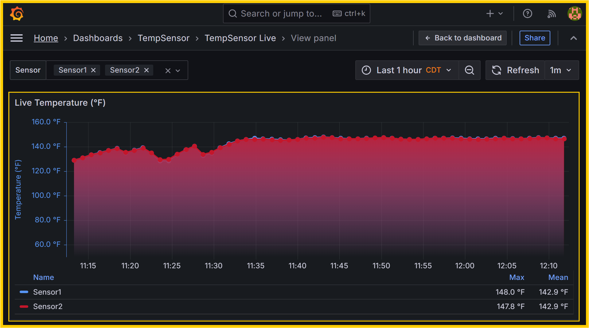
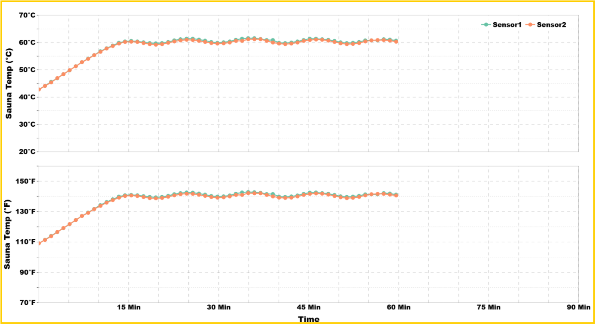
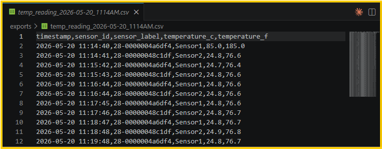

# TempSensor

Live DS18B20 temperatures in Grafana. Each run is also saved as a CSV.



```bash
make start
make stop
make status
make logs
make clean
make help
```

`make start` asks for the test unit and serial number, then starts the stack. Grafana is at http://localhost:3000 (admin / admin). Temperatures show live, and each reading is appended to a CSV.

`make stop` stops the stack, cleans the latest CSV, and writes Fahrenheit and Celsius charts.





`make status` shows whether each service is running. `make logs` follows the container logs. `make clean` deletes the InfluxDB data.
